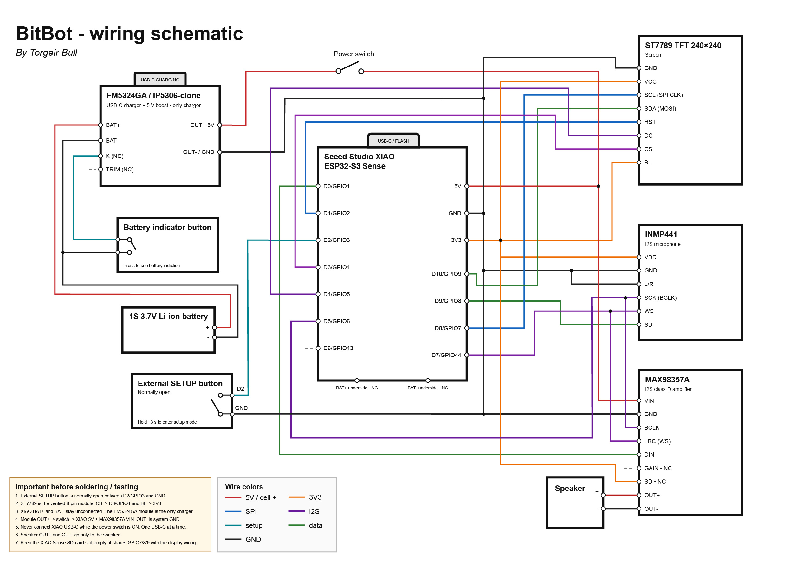

# BitBot

**A tiny robot face with a voice, a camera, and a big personality.**

BitBot is a DIY AI companion built around the Seeed Studio XIAO ESP32-S3 Sense. It listens for a wake phrase or a button press, shows expressions and captions on a 240 × 240 screen, and can take a photo when asked what it sees. Its voice pipeline sends replies to a small speaker. The ESP32-S3 handles the hardware and local wake detection; conversations run through XiaoZhi over Wi-Fi.

> **Prototype status:** The display, face, camera, setup portal, wake phrases, and XiaoZhi conversation path have been implemented and tested in stages. Audible output from the physical speaker and the battery power system still need final bench verification. Battery life has not been measured.

## Meet the hardware



[Open the full-size circuit diagram](bitbot-wiring.jpg) · [Read the latest wiring notes](docs/wiring.md)

The image shows how the controller, screen, microphone, amplifier, speaker, controls, and power module fit together. It is a **prototype schematic**, so check the wiring notes before building: for example, the current notes connect the amplifier's `SD` pin to 3V3, while the image labels it `NC`.

### Parts at a glance

| Part | What it does |
| --- | --- |
| **Seeed Studio XIAO ESP32-S3 Sense** | Runs BitBot; includes Wi-Fi and the camera. |
| **1.54-inch ST7789 display, 240 × 240, 8-pin** | Shows the animated face, setup instructions, photos, and captions. |
| **INMP441 I²S microphone** | Captures speech. |
| **MAX98357A I²S amplifier + small speaker** | Plays BitBot's replies. |
| **Momentary button** (optional) | Starts a conversation or reopens setup; the onboard BOOT button also works. |
| **1S Li-ion cell, charger/5 V boost module, and latching switch** | Planned portable power; validate the cell and charging current before connecting them. |

See the [full component list](docs/components.md) for module details and the [hardware notes](docs/hardware.md) for electrical constraints. The Sense board's SD card slot stays empty because its pins are shared with the display.

## How BitBot works

1. **Set it up.** On first boot, BitBot opens its own Wi-Fi hotspot. Join it and open `http://192.168.4.1` to save a 2.4 GHz network and preferences. The screen shows setup information.
2. **Get its attention.** Press BOOT or the optional external button, or say **“hey robot”** or **“hey bit robot”**. Wake detection runs on the ESP32-S3. A custom “hey BitBot” wake model is future work.
3. **Have a conversation.** The microphone audio travels to XiaoZhi over Wi-Fi. BitBot receives the reply as text and audio, shows captions and a matching expression, and sends the audio to its speaker.
4. **Ask what it sees.** When the assistant requests a photo, BitBot captures one with the Sense camera, previews it on the display, and sends it to the vision service. The camera is not used continuously for conversation.

The face has twelve expressions, blinking eyes, and a dimmed idle view. Press the button again to interrupt or end a reply. [Learn more about the architecture](docs/architecture.md).

## What works today

| Area | Status |
| --- | --- |
| Screen, expressions, and captions | Implemented; ST7789 wiring verified on hardware. |
| Wi-Fi setup | Local English portal, saved network profiles, and a desktop simulator. |
| Voice and vision | XiaoZhi pairing and conversation flow, local wake phrases, and on-demand camera capture are implemented. Physical speaker output is still being diagnosed. |
| Portable power | Circuit planned; charging current, boost behavior, and battery runtime still need measurement. |

BitBot is a hands-on prototype, not a finished product. The [next-steps checklist](docs/next-steps.md) tracks the remaining physical tests.

## Try the setup portal on your computer

The simulator lets you explore BitBot's settings without hardware or an AI account. Install **Node.js 22 or later**, then run:

```sh
npm ci
npm run dev
```

Open **http://127.0.0.1:4173**. The simulator stores preferences in ignored `.local/simulator.json`; use dummy credentials. Its Wi-Fi checks are simulated and it makes no AI calls. To exercise a failed network test, enter `wrong-password`; other valid demo passwords simulate success.

## Build and flash the device

The firmware targets **ESP-IDF 6.0.2** and the original **XIAO ESP32-S3 Sense**. In an ESP-IDF shell:

```sh
cd firmware
idf.py set-target esp32s3
idf.py build
idf.py -p COM5 flash monitor
```

Replace `COM5` with your board's serial port. If you do not have ESP-IDF locally, see the [CI artifact flashing guide](docs/flashing.md). On first boot, join the `BitBot-XXXX` hotspot and open **http://192.168.4.1**. Holding BOOT for three seconds after startup reopens setup without erasing saved settings.

**Start on USB power with the battery module disconnected.** Read the [wiring guide](docs/wiring.md) before connecting external power. The XIAO's USB-C port and the boost module's switched 5 V output must not power the board at the same time.

## For contributors

Run the portal build and automated checks with:

```sh
npm ci
npx playwright install chromium
npm run check
```

The build generates compressed portal assets in `firmware/main/generated/`; commit those assets when changing `web/` or the settings schema. GitHub Actions also compiles the ESP32-S3 firmware.

| Path | Contents |
| --- | --- |
| [`firmware/`](firmware/) | ESP-IDF firmware for setup, face, audio, camera, and network. |
| [`web/`](web/) | Local setup portal shared by the device and simulator. |
| [`hwtest/`](hwtest/) | Separate hardware bring-up firmware. |
| [`docs/`](docs/) | Wiring, components, architecture, flashing, and progress notes. |
| [`BitBot_PROJECT_SPEC.md`](BitBot_PROJECT_SPEC.md) | Original project vision and requirements. |

This developer firmware stores credentials in NVS without flash encryption. Use test credentials while developing, and do not commit passwords or API keys.
