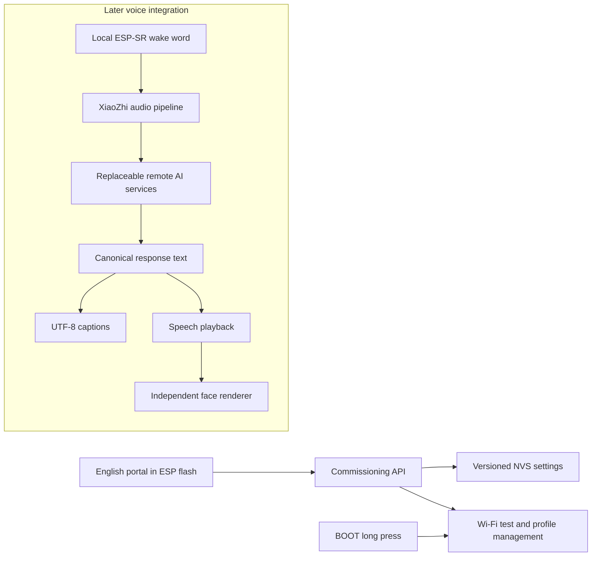

# BitBot: first development milestone

Research date: 2026-09-08. Read alongside `BitBot_PROJECT_SPEC.md`.

## Decision

Use **XiaoZhi as the foundation for the voice assistant**, with a separate
BitBot board, face renderer, and commissioning/settings component. First build
and verify commissioning independently; do not boot unverified external GPIOs.
The repository's first runnable firmware is this commissioning application,
not the finished talking robot. The same English portal runs on the device and
in a clearly labelled desktop simulator. No external website, CDN, or account
is needed to load the portal.

### Upstream inspection

| Reference | Inspected revision | Finding |
| --- | --- | --- |
| [78/xiaozhi-esp32](https://github.com/78/xiaozhi-esp32/tree/c7241272f2d5fd140c77542f3cf12d09e717fc2f) | `c7241272f2d5fd140c77542f3cf12d09e717fc2f` | MIT; ESP-IDF 6.0.2 preferred by its README. Provides ESP-SR wake word, Opus/audio pipeline, MCP tools, display/camera abstractions, and configurable network transports. |
| [AI Pin](https://github.com/idevloop/AI_Pin-Wearable_Voice_Assistant_XIAO_ESP32S3_Sense/tree/a2f44493c40593d34b7f10bdf043655eb53d3881) | `a2f44493c40593d34b7f10bdf043655eb53d3881` | MIT derivative of XiaoZhi; mostly a board header and prebuilt binaries. PDM microphone and SSD1306 differ from BitBot. RGB GPIO19/20 conflict with native USB. Do not flash its binary onto BitBot's proposed wiring. |

Inspected XiaoZhi's `main/boards/common/wifi_board.cc`, board guide,
`main/idf_component.yml`, camera board implementation, and audio codec interface.
Its `78/esp-wifi-connect` 3.2.2 dependency already supports saved networks,
connection backoff, and captive provisioning. However, the inspected portal
opens an unsecured AP, provides no public custom-route/server hook, and uses
GET requests for some mutations. Its DNS response builder also needs packet
bounds checks before reuse. BitBot therefore implements a small independent
commissioning component on ESP-IDF's Wi-Fi/HTTP/NVS APIs, while retaining the
decision to reuse XiaoZhi's much larger voice pipeline. No upstream source or
prebuilt binary is copied into this milestone. Recheck licences and preserve
notices when importing code later.

## User journey

1. First boot opens a password-protected `BitBot-XXXX` hotspot. During this
   bring-up build the setup password is explicitly displayed on USB serial,
   not written to ordinary logs. The ST7789 must show it in the next milestone.
2. Join that hotspot, stay connected even if the phone says "no internet", and
   open `http://192.168.4.1`. A captive-portal redirect is a convenience; that
   numeric address is always the documented fallback.
3. Scan for 2.4 GHz Wi-Fi, select a network, enter its password, and test it.
   Only a successful association **and DHCP lease** stores/replaces the profile.
   This does not prove internet or AI-service access. Failed attempts preserve
   existing credentials and assistant settings. Up to five profiles are kept.
4. Adjust assistant preferences and save. Leave a key blank to keep it;
   removing a key is a separate explicit operation. Secrets never appear in
   settings responses.
5. Finish setup. The device restarts, closes the hotspot, and tries saved
   networks. If those are unavailable, it retries with a bounded delay.
6. At another location, hold **BOOT for three seconds after boot** to reopen
   setup. Nothing is erased. RESET only reboots. BOOT held during power-on
   enters the ROM downloader and cannot trigger application setup.

After initial commissioning, setup requires the physical button; loss of Wi-Fi
does not silently expose configuration. Setup closes after ten minutes and
returns to connection attempts. The first-boot portal stays available until
a network is configured. The latching power switch is not a settings button.
An accessible momentary button can be added later once its pin is verified.

## Architecture boundaries

The commissioning build does not capture microphone/camera data or call an
AI provider. Independent conversation/speech providers, personality, voice, and
display preferences are stored for integration; saving them must not imply that
those integrations exist.
The simulator never joins networks or invokes a paid API.

## Security and storage

- Random per-device WPA2 setup password, generated on first boot and persisted.
  Never derive a password from the MAC. Treat it as a physical setup credential.
- Local HTTP is restricted to the AP interface/subnet. No administration on the
  joined LAN. Require a per-session token header for API mutations; reject
  foreign origins and bound bodies. Do not enable CORS.
- NVS is not a vault by default. This developer firmware has **no flash/NVS
  encryption or secure boot**. Physical flash extraction can reveal credentials.
  Before sharing finished devices, provision encryption/secure boot deliberately;
  prefer scoped device tokens instead of high-value provider keys.
- Use one versioned NVS document with validated bounded settings and network
  profiles. Commit successful changes before updating RAM. Never automatically
  erase NVS on corruption or a version mismatch.
- No Wi-Fi passwords/API keys in Git, logs, status, exported public settings,
  or browser persistent storage. Desktop simulator persistence is under ignored
  `.local/`; use dummy credentials there.
- Later cloud clients must verify TLS certificates and time, limit responses,
  and support timeouts/cancellation. Do not weaken TLS to make a demo work.

## Memory, power, and remaining risks

Update 2026-09-10: the owner confirmed a seven-pin ST7789 with no CS. An optional
native `esp_lcd` bring-up driver now uses that interface; see `hardware.md` for
the exact pin list and remaining supply/backlight checks. It uses a 7,680-byte
DMA stripe buffer and waits for transfer completion before reuse. It is disabled
by default, so external wiring is not energized just by flashing commissioning.

The target is the original XIAO ESP32-S3 Sense (8 MB flash, 8 MB PSRAM), not a
Plus variant. Confirm the installed board and sensor. Commissioning keeps the
web assets compressed in flash and limits requests to 12 KiB. A 240×240 RGB565
frame alone uses 115,200 bytes; reserve PSRAM for camera frames/audio where
supported and keep DMA-capable buffers in suitable memory. Actual combined
heap/PSRAM measurements come before choosing full frame double-buffering.

[ESP-SR WakeNet](https://docs.espressif.com/projects/esp-sr/en/latest/esp32s3/wake_word_engine/README.html)
supports ESP32-S3, but changing a string does not create a trained "Hey BitBot"
detector. Start with push-to-talk or a supported model, then train/provision and
measure that exact phrase. Microphone inference needs a running audio/CPU path;
ordinary deep sleep cannot keep it running. Measure idle, listening, speaking,
Wi-Fi, and camera current before promising runtime from the 350 mAh cell.

School/enterprise Wi-Fi, hotel captive login pages, AP client isolation, and
5-GHz-only networks are not covered by WPA2 personal provisioning. A 2.4 GHz
phone hotspot is a practical demo network. A self-hosted AI service must also
be reachable from the new location; storing its address does not provide that
reachability.
